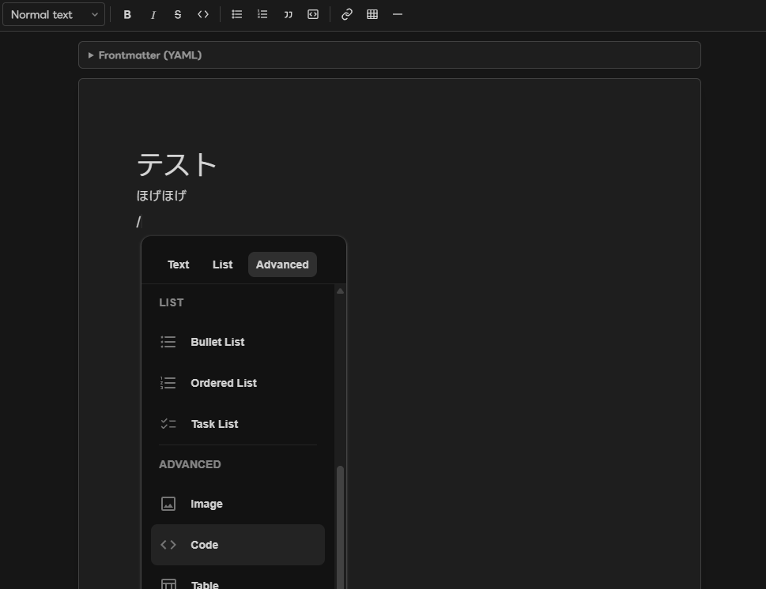

# mdEditor (VSCode Extension)

Markdown ファイルをいい感じに編集する VSCode Extension。




## インストール

### 1. VSIX を DL

最新の `mdEditor.vsix` は [Releases ページ](https://github.com/Alicey0719/vscode-md-editor/releases/latest) から取得できます。

CLI ワンライナー:

```bash
curl -L -o /tmp/mdEditor.vsix \
  https://github.com/Alicey0719/vscode-md-editor/releases/latest/download/mdEditor.vsix
```

### 2. インストール

方法A: **CLI (一番速い)**

```bash
code --install-extension /tmp/mdEditor.vsix
```

方法B: **VSCode GUI**

1. コマンドパレットを開く (`Ctrl+Shift+P` / `Cmd+Shift+P`)
2. `Extensions: Install from VSIX...` と入力して選択
3. `.vsix` ファイルを選ぶ

方法C: **Extensions パネル**

1. 左サイドバーの Extensions アイコン
2. パネル上部の `...` メニュー → `Install from VSIX...`

### 3. 使う

install 後、VSCode を再起動 (または `Developer: Reload Window`) してから:

- 任意の `.md` ファイルを右クリック → **"Open in mdEditor"**
- または コマンドパレット → **"Open in mdEditor"**

### アンインストール

```bash
code --uninstall-extension alicey.md-editor
```

## v1 スコープ

* `.md` ファイルを右クリック → "Open in mdEditor" で起動

* Frontmatter (YAML) は上部 textarea で raw 編集

* 本文は Milkdown Crepe による WYSIWYG (見出し / bold / italic / list / table / code fence / image / link)

* 画像 paste / drop → sibling `img/<sha256-16>.<ext>` に自動保存 → 相対パス挿入 (重複は dedup)

* Ctrl+S で標準の VSCode save に乗る (dirty indicator / git 統合ok)

## 開発

```bash
npm ci --ignore-scripts   # supply chain 対策で postinstall を止める
npm run build             # dist/ と media/ を生成
```

VSCode で本ディレクトリを開き `F5` で Extension Development Host を起動。

`npm run watch` で host / webview の watch build。

## Security メモ

* Untrusted workspace では動作しない (`capabilities.untrustedWorkspaces.supported: false`)

* Webview は strict CSP + nonce、`connect-src 'none'` で outbound 遮断

* 画像 write は sibling `img/` 配下 + hex hash + magic-byte 検証で path traversal / mime spoofing を防止

* SVG は v1 では reject (XSS リスク)

* 依存は全て bundle、runtime CDN load 禁止

